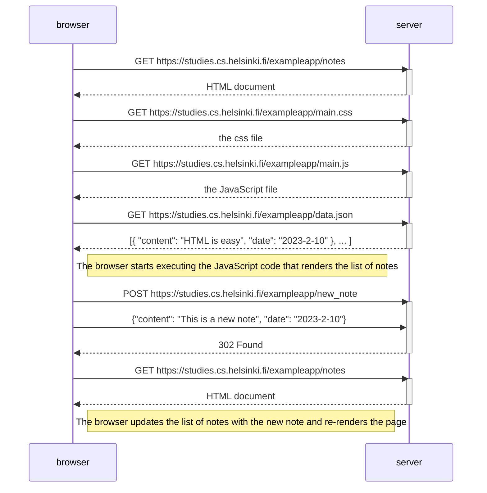

```mermaid
sequenceDiagram
  participant browser
participant server

browser->>server: GET https://studies.cs.helsinki.fi/exampleapp/notes
activate server
server-->>browser: HTML document
deactivate server

browser->>server: GET https://studies.cs.helsinki.fi/exampleapp/main.css
activate server
server-->>browser: the css file
deactivate server

browser->>server: GET https://studies.cs.helsinki.fi/exampleapp/main.js
activate server
server-->>browser: the JavaScript file
deactivate server

browser->>server: GET https://studies.cs.helsinki.fi/exampleapp/data.json
activate server
server-->>browser: [{ "content": "HTML is easy", "date": "2023-2-10" }, ... ]
deactivate server

Note right of browser: The browser starts executing the JavaScript code that renders the list of notes 

browser->>server: POST https://studies.cs.helsinki.fi/exampleapp/new_note
activate server
browser->>server: {"content": "This is a new note", "date": "2023-2-10"}
server-->>browser: 302 Found
deactivate server

browser->>server: GET https://studies.cs.helsinki.fi/exampleapp/notes
activate server
server-->>browser: HTML document
deactivate server

Note right of browser: The browser updates the list of notes with the new note and re-renders the page

```