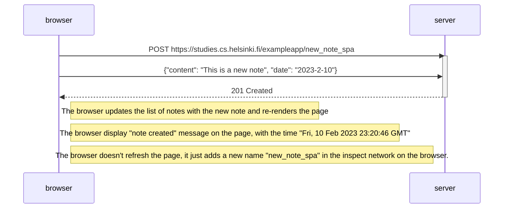

```mermaid
sequenceDiagram
    participant browser
    participant server

    browser->>server: POST https://studies.cs.helsinki.fi/exampleapp/new_note_spa
    activate server
    browser->>server: {"content": "This is a new note", "date": "2023-2-10"}
    server-->>browser: 201 Created
    deactivate server

   Note right of browser: The browser updates the list of notes with the new note and re-renders the page
Note right of browser: The browser display "note created" message on the page, with the time "Fri, 10 Feb 2023 23:20:46 GMT"
Note right of browser: The browser doesn't refresh the page, it just adds a new name "new_note_spa" in the inspect network on the browser.

```
